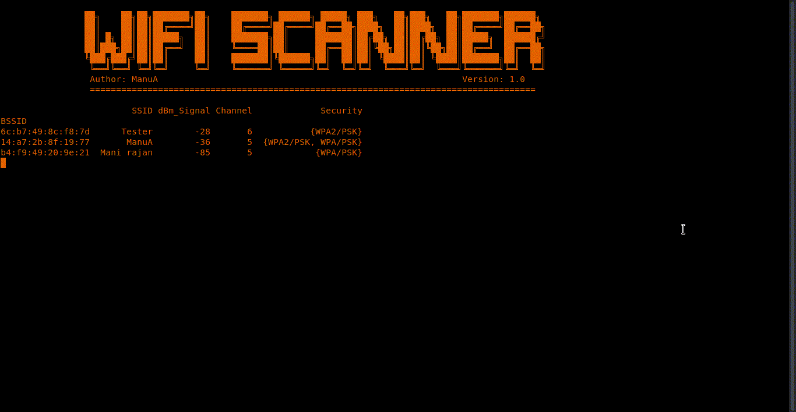

# Wifi-Scanner
A simple tool to scan for available APs and display their Signal Strength, Security Protocol, SSID and channels. Written in Python (Scapy Module)

# Demo



# Usage

```sudo python3 wifi_scanner.py```
